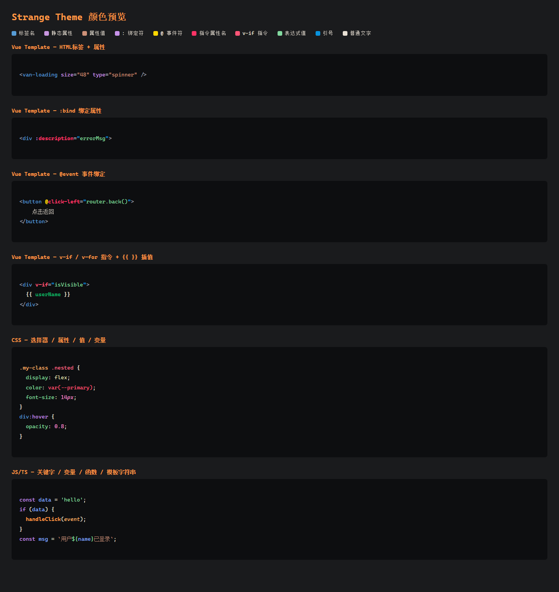

# Strange Theme

[](https://github.com/414564120/Strange-theme/releases/latest)
[](LICENSE)

Strange Theme 是一款面向 Vue 开发的暖色暗色主题。它通过分区颜色、Vue 指令高亮和语义高亮，提高单文件组件以及 TypeScript、JavaScript、CSS、JSON 和 Markdown 的可读性。

当前版本：`0.0.7`；扩展标识：`Oelyn.strange-theme`。



## 功能特点

- 使用不同颜色区分 `<template>`、`<script>` 和 `<style>` 区域。
- 分别显示静态属性、Vue 指令、动态绑定、事件绑定和插值表达式。
- 为函数、变量、参数、属性、类和类型提供语义高亮。
- 为 CSS、SCSS、JSON 和 Markdown 提供专用着色规则。
- 包含 59 个工作台颜色、60 条 TextMate 规则和 32 条语义标记规则。
- 不包含运行时代码、遥测、网络访问或后台服务。

## 支持的编辑器

| 编辑器 | 安装方式 | 扩展仓库 |
| --- | --- | --- |
| Visual Studio Code | 扩展市场或 VSIX | [VS Code Marketplace](https://marketplace.visualstudio.com/items?itemName=Oelyn.strange-theme) |
| Cursor | 扩展搜索或 VSIX | [Cursor Marketplace](https://cursor.com/marketplace) |
| VSCodium / Eclipse Theia | 扩展仓库或 VSIX | [Open VSX](https://open-vsx.org/extension/Oelyn/strange-theme) |
| Trae 及其他 VS Code 兼容编辑器 | VSIX | 以编辑器当前支持方式为准 |

## 安装

### 从扩展仓库安装

在编辑器的扩展面板中搜索 `Strange Theme`，确认发布者为 `Oelyn`，然后点击安装。

### 从 VSIX 安装

1. 从 [GitHub Releases](https://github.com/414564120/Strange-theme/releases/latest) 下载 VSIX 文件。
2. 打开编辑器的扩展面板。
3. 选择“从 VSIX 安装”，然后选中下载的文件。
4. 运行“首选项：颜色主题”，选择 `Strange Theme`。

## 可选编辑器设置

主题会为括号和缩进参考线提供颜色，但安装时不会修改用户设置。需要时可自行启用：

```json
{
  "editor.bracketPairColorization.enabled": true,
  "editor.guides.bracketPairs": "active",
  "editor.guides.indentation": true,
  "editor.guides.highlightActiveBracketPair": true,
  "editor.guides.highlightActiveIndentation": true
}
```

## Vue 配色

| 语法 | 颜色 |
| --- | --- |
| `<template>` | `#F2858C` |
| `<script>` | `#FFD700` |
| `<style>` | `#21BD9E` |
| Vue 指令 | `#FF5577` |
| 动态绑定 | `#C792EA` |
| 事件绑定 | `#FFD700` |
| 静态 HTML 属性 | `#C896E0` |
| 函数 / 方法 | `#FF9944` |
| 变量 | `#82AAFF` |
| 属性 | `#82D99F` |

## 本地开发

需要 Node.js 22 或更高版本，并使用 pnpm：

```powershell
pnpm install
pnpm validate
pnpm package --out strange-theme.vsix
```

修改主题规则前，建议打开 `test-fixtures/` 中的示例文件，并通过“开发人员：检查编辑器标记和作用域”确认实际 TextMate 作用域。

项目发布流程见 [发布指南](docs/PUBLISHING.md)。

## 隐私

本扩展是纯声明式颜色主题，不执行扩展代码，也不收集任何数据。

## 许可证

本项目使用 [MIT 许可证](LICENSE)。
